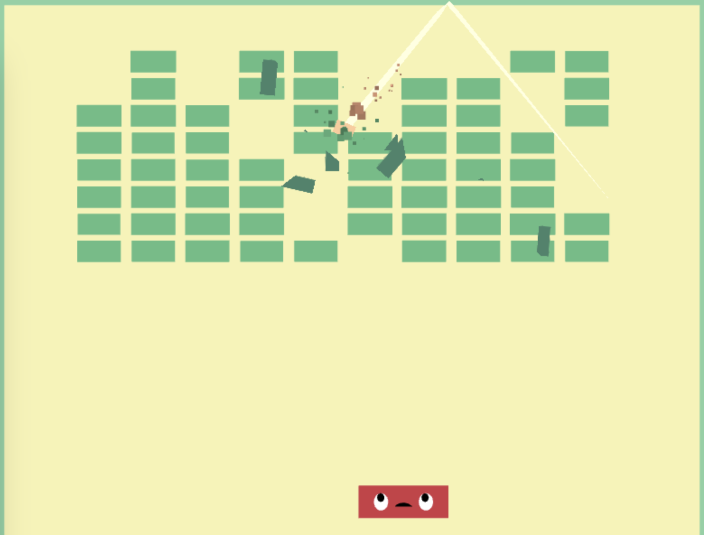

   

[Live version](https://vangelov.github.io/pixi-breakout/)

## Pixi Breakout

This project is TypeScript reimplementation of [Juicy Breakout](https://github.com/grapefrukt/juicy-breakout) using Pixi.js.

## Scripts

In the project directory, you can run:

#### `npm run dev`

Runs the app in the development mode.\
Open [http://localhost:8080/](http://localhost:8080/) to view it in the browser.

#### `npm run build`

Builds the app for production in the `dist` folder.
